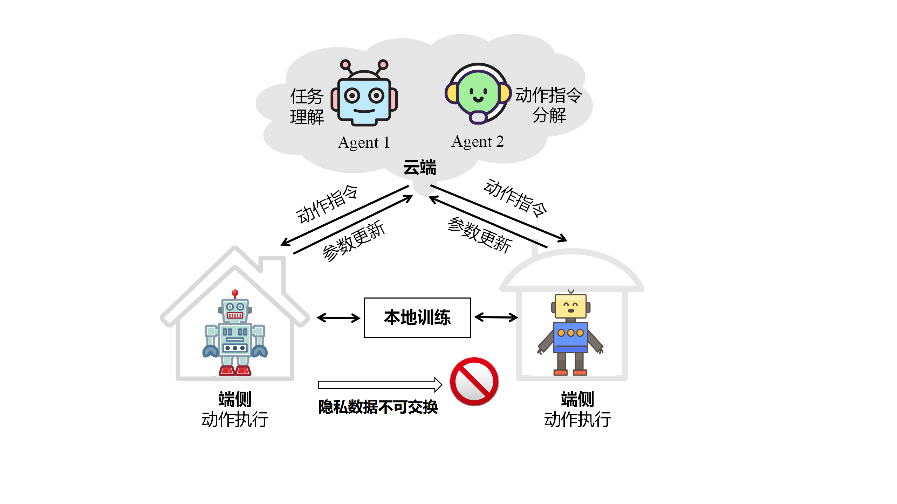

# Airobot

Airobot integrates ​​edge-cloud collaboration​​ and ​​federated learning，ensuring both high performance and compliance with privacy constraints. By combining the cloud's task parsing/planning capabilities with the edge's lightweight model execution, it forms an intelligent, high-performance, and scalable framework.

## Acknowledgements
Airobot is based on TEACh Two-Agent Task Completion (TATC) Challenge
[Task-driven Embodied Agents that Chat](https://arxiv.org/abs/2110.00534)

TEACH (Task-drive Embodied Agents that Chat) is a set of episodes in which a human Commander who knows what task needs to be accomplished and where objects in a scene are located works with a human Follower who controls a virtual agent in the scene to accomplish household chores. The Commander and Follower communicate via natural language text. TEACh enables researchers to study strategies for natural language cooperation, instruction following from egocentric vision, question and answer generation, and partner modeling. We believe these skills will be necessary for real-world language-driven robotics applications.

## License and Citation
All assets and code are under the [Apache 2.0 license](./LICENSE) unless specified otherwise.

If this work is helpful for your research, please consider citing the following BibTeX entry.